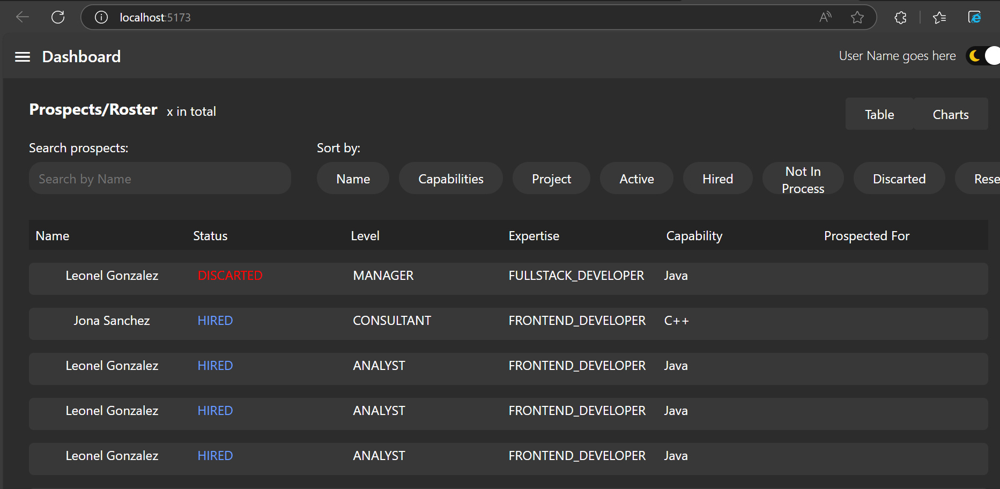

# Internal Dashboard



## Needed Dependencies

* Podman
* IDE capable of running local Java env
* NPM
* Postegres

## Dashboard Database

### Setup Postegres Container

It is important this is setup first.

```bash
podman network create mynetwork
```

```bash
podman run -d --name postgresdb --network mynetwork -e POSTGRES_DB=postgres -e POSTGRES_USER=user -e POSTGRES_PASSWORD=password -p 6432:5432 postgres:17.4-alpine
```

## Dashboard Backend

In ```resources/application.properties``` change the uncommented endpoint to the one appropriate (```local-dev``` or ```container-env```).

### Setup Local Dev Enviorment

After correct ```resources/application.properties``` modification run in IDE of choice.

### Setup Containers

All done inside dashboard-back folder.

```bash
mvn clean package -DskipTests
```

```bash
podman build -t backend -f .\DOCKERFILE
```

```bash
podman run -d --name backend --network mynetwork -p 8080:8080 backend
```

## Dashboard Front End

In ```dashboard-front/src/data/endpoints/api_endpoints/api_endpoints.ts``` change the uncommented endpoints to the ones appropriate (```local-dev``` or ```container-env```).

### Setup Local Dev

All done inside dashboard-front folder.

```bash
npm install
```

```bash
npm run dev
```

### Setup Container

All done inside dashboard-front folder.

```bash
podman build -t dashboard_front -f .\DOCKERFILE
```

```bash
podman network create mynetwork
```

```bash
podman run --name dashboard_front --network mynetwork -p 5173:80 dashboard_front
```
